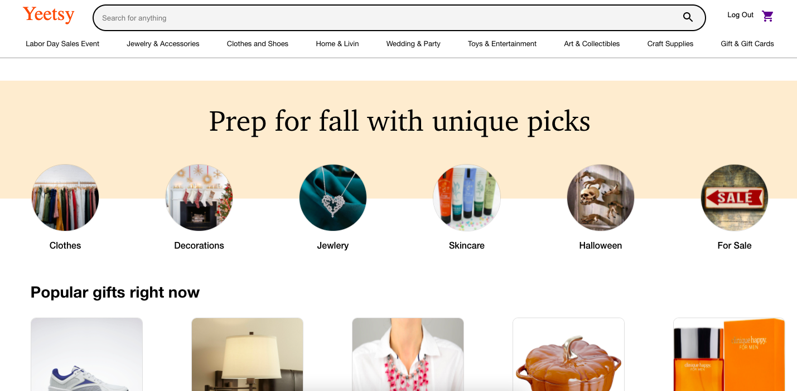
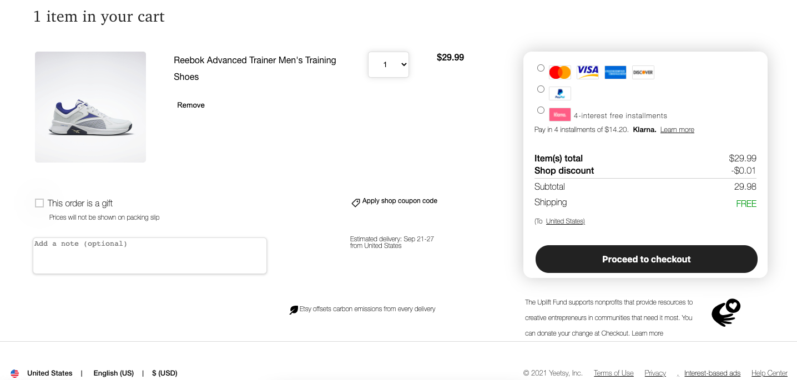

# Yeetsy
## Overview
Yeetsy is Etsy clone, an E-commerce website with a concentration hand-crafted artisan goods.

## Technology
* Ruby on Rails
* PostgreSQL
* Rails Active Storage with Amazon's S3
* React.js
* Redux

## Core Features
### Product Listing
* Displays an assortment of products which the user can view and select.
* The products are listed in sections of rows which display the products by category or row style.

### Cart Item
* Yeetsy is an E-commerce website, users can buy products.
* Users can add products to the cart, delete products from the cart, and update from the cart.
* Users can checkout to proceed to the checkout page.

